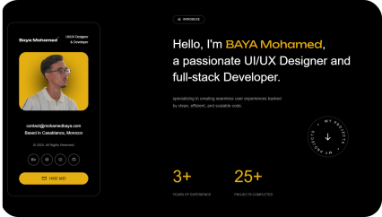
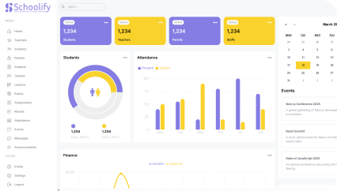

# Mohamed BAYA

**`(Developer/UI/UX Designer)`**

I'm a Moroccan full-stack developer and ui/ux designer building my version of the digital world one step at a time. All coding projects are built from the ground up, from planning and designing all the way to solving real-life problems with code.

###

#  Languages and Tools:

  
  
  
  
  
  
  
  
  
  
  
  
  
  
  

# Stats:

  

# Projects:

  
  
  

 

<picture>
  <source media="(prefers-color-scheme: dark)" srcset="https://raw.githubusercontent.com/Mohamedev2004/Mohamedev2004/output/github-snake-dark.svg" />
  <source media="(prefers-color-scheme: light)" srcset="https://raw.githubusercontent.com/Mohamedev2004/Mohamedev2004/output/github-snake.svg" />
  
</picture>
